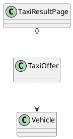

# UC-10 — View Taxi Rental Results

### Description

As a traveller, I want to browse available vehicle-and-driver rental offers for my selected location and period.

### Actors

Traveller; Taxi Rental Service.

### Priority

P0.

### Trigger

**TRG-UC-10-01** — The client receives a taxi-rental search result context.

### Preconditions

- **PRE-UC-10-01** — A taxi-rental search result context is available to the client.

### Postconditions

- **POST-UC-10-01** — The client displays the returned result-page state.
- **POST-UC-10-02** — The displayed rental context remains available for navigation or revision.

### Basic Flow

1. The client opens the Taxi results view for the current search context.
2. The client requests the corresponding result page.
3. The system processes the request and returns a page outcome.
4. The client renders the location and period summary with the returned vehicle cards.
5. The traveller reviews vehicle name, rating, capacity, transmission, baggage, mileage allowance, and price.
6. The traveller may select View Details for an offer.

### Alternative Flows

#### AF-UC-10-01

1. If the response contains no offer presentations, the client displays the designed no-results state and keeps the search summary available.

#### AF-UC-10-02

1. The traveller requests another result page from the current search context.

### Exception Flows

#### EF-UC-10-01

1. If another result page cannot be loaded, the client keeps the displayed results and offers a retry.

#### EF-UC-10-02

1. If the system returns an unusable-context outcome, the client presents the supplied recovery action.

### UML Model

Classifiers and operations are defined in the [shared domain model](shared-domain-model.md).



### Business Rules

```ocl
-- BR-UC-10-01
-- Source: Assumption
context TaxiResultPage
inv BR_UC_10_01_PageBelongsToOneSearchSnapshot:
  self.items->forAll(o |
    o.searchContextId = self.searchContextId and o.snapshotVersion = self.snapshotVersion)
```

```ocl
-- BR-UC-10-02
-- Source: Assumption
context TaxiResultPage
inv BR_UC_10_02_PageMetadataMatchesItsSlice:
  self.total = self.orderedOfferIds->size() and self.limit > 0 and self.offset >= 0 and
  self.items->size() = (self.total - self.offset).max(0).min(self.limit) and
  self.hasMore = (self.offset + self.items->size() < self.total)
```

```ocl
-- BR-UC-10-03
-- Source: Assumption
context TaxiResultPage
inv BR_UC_10_03_PageInventoryWasLiveAtSnapshotCreation:
  self.items->forAll(o | o.available and o.expiresAt > self.capturedAt) and
  self.validUntil > self.capturedAt and self.items->forAll(o | self.validUntil <= o.expiresAt)
```

```ocl
-- BR-UC-10-04
-- Source: Assumption
context TaxiResultPage
inv BR_UC_10_04_OfferIdentifiersDoNotRepeatAcrossThePage:
  self.items->isUnique(o | o.id)
```

```ocl
-- BR-UC-10-05
-- Source: Assumption
context TaxiResultPage
inv BR_UC_10_05_PresentationOrderIsStableWithinTheSnapshot:
  self.items->size() <= 1 or
  Sequence{1..self.items->size() - 1}->forAll(i |
    self.items->at(i).rank < self.items->at(i + 1).rank)
```

```ocl
-- BR-UC-10-06
-- Source: Assumption
context TaxiResultPage
inv BR_UC_10_06_PageIsExactSliceOfTheOrderedSnapshot:
  self.orderedOfferIds->isUnique(id | id) and
  (if self.items->isEmpty() then self.offset >= self.total
   else Sequence{1..self.items->size()}->forAll(i |
     self.items->at(i).id = self.orderedOfferIds->at(self.offset + i)) endif)
```

```ocl
-- BR-UC-10-07
-- Source: Figma
context TaxiResultPage
inv BR_UC_10_07_CardsContainComparableRentalFacts:
  self.items->forAll(o |
    o.total.currency = self.currency and o.total.amount >= 0 and o.rating >= 0 and o.rating <= 5 and
    o.vehicle.seatCapacity > 0 and o.vehicle.largeBagCapacity >= 0 and
    o.vehicle.smallBagCapacity >= 0 and o.mileageAllowanceKm >= 0)
```

### Related UI

`taxi list`; `Kurunegala: 68 Cars available`; vehicle result cards; `View Details`.

### Related APIs

`API-TAXI-SEARCH`.
