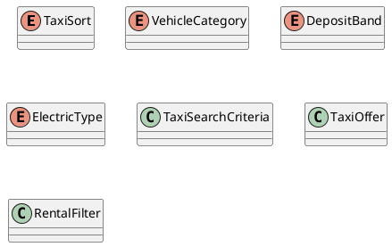

# UC-11 — Filter and Sort Taxi Rental Results

### Description

As a traveller, I want to refine taxi-rental offers by car category, pick-up deposit, electric type, and the available sort control.

### Actors

Traveller; Taxi Rental Service.

### Priority

P1.

### Trigger

**TRG-UC-11-01** — The traveller chooses to refine the displayed Taxi results.

### Preconditions

- **PRE-UC-11-01** — The traveller is viewing Taxi results for a search context.

### Postconditions

- **POST-UC-11-01** — The results view displays the refinement outcome returned by the system.
- **POST-UC-11-02** — The search context remains available for another result interaction.

### Basic Flow

1. The traveller opens the Taxi filter or sort controls.
2. The client displays car category, deposit, electric-car, and sort selections.
3. The traveller changes one or more selections and applies them.
4. The client submits the revised preferences with the current search context.
5. The system processes the request and returns a refinement outcome.
6. The client renders the returned result state and selections.

### Alternative Flows

#### AF-UC-11-01

1. The traveller clears the displayed refinements and requests the base result view.

#### AF-UC-11-02

1. On mobile, the traveller dismisses the filter panel without applying pending changes.

### Exception Flows

#### EF-UC-11-01

1. If the refresh cannot be completed, the client keeps the previously displayed result state.
2. The client presents the retry action returned for the failed refresh.

### UML Model

Classifiers and operations are defined in the [shared domain model](shared-domain-model.md).



### Business Rules

```ocl
-- BR-UC-11-01
-- Source: Assumption
context TaxiService::search(criteria: TaxiSearchCriteria): Sequence(TaxiOffer)
post BR_UC_11_01_RefinementCannotEscapeTheAcceptedSearch:
  result->forAll(o | criteria.searchContextId = null or o.searchContextId = criteria.searchContextId)
```

```ocl
-- BR-UC-11-02
-- Source: Figma
context TaxiService::search(criteria: TaxiSearchCriteria): Sequence(TaxiOffer)
post BR_UC_11_02_SelectedCarCategoriesApply:
  result->forAll(o |
    criteria.vehicleCategories->isEmpty() or
    criteria.vehicleCategories->includes(o.vehicle.category))
```

```ocl
-- BR-UC-11-03
-- Source: Figma
context TaxiService::search(criteria: TaxiSearchCriteria): Sequence(TaxiOffer)
post BR_UC_11_03_SelectedDepositBandsApply:
  result->forAll(o | RentalFilter::depositMatches(criteria.depositBands, o.deposit))
```

```ocl
-- BR-UC-11-04
-- Source: Figma
context TaxiService::search(criteria: TaxiSearchCriteria): Sequence(TaxiOffer)
post BR_UC_11_04_SelectedElectricTypesApply:
  result->forAll(o | RentalFilter::electricMatches(criteria.electricTypes, o.vehicle.electricType))
```

```ocl
-- BR-UC-11-05
-- Source: Assumption
context TaxiService::search(criteria: TaxiSearchCriteria): Sequence(TaxiOffer)
pre BR_UC_11_05_ChangedRefinementStartsANewResultTraversal:
  criteria.offset >= 0 and criteria.limit > 0 and
  (SearchSnapshot::refinementChanged(criteria) implies criteria.offset = 0)
```

```ocl
-- BR-UC-11-06
-- Source: Figma
context TaxiService::search(criteria: TaxiSearchCriteria): Sequence(TaxiOffer)
post BR_UC_11_06_TopPicksOrderIsDeterministic:
  criteria.sort = TaxiSort::TOP_PICKS implies
    (result->size() <= 1 or Sequence{1..result->size() - 1}->forAll(i |
      result->at(i).recommendationScore > result->at(i + 1).recommendationScore or
      (result->at(i).recommendationScore = result->at(i + 1).recommendationScore and
       result->at(i).id < result->at(i + 1).id)))
```

```ocl
-- BR-UC-11-07
-- Source: Assumption
context TaxiService::search(criteria: TaxiSearchCriteria): Sequence(TaxiOffer)
pre BR_UC_11_07_OptionalPriceBoundsAreCoherent:
  (criteria.minPrice = null or criteria.minPrice >= 0) and
  (criteria.maxPrice = null or criteria.maxPrice >= 0) and
  (criteria.minPrice = null or criteria.maxPrice = null or criteria.minPrice <= criteria.maxPrice)
```

```ocl
-- BR-UC-11-08
-- Source: Assumption
context TaxiService::search(criteria: TaxiSearchCriteria): Sequence(TaxiOffer)
pre BR_UC_11_08_ContinuationReferencesAUsableSnapshot:
  (criteria.searchContextId = null and criteria.snapshotVersion = null) or
  (criteria.searchContextId <> null and criteria.snapshotVersion <> null and
   SearchSnapshot::accepts(criteria, RequestContext::startedAt))
```

```ocl
-- BR-UC-11-09
-- Source: Assumption
context TaxiService::search(criteria: TaxiSearchCriteria): Sequence(TaxiOffer)
post BR_UC_11_09_PriceBoundsApplyWithTheVisibleFilters:
  result->forAll(o |
    (criteria.minPrice = null or o.total.amount >= criteria.minPrice) and
    (criteria.maxPrice = null or o.total.amount <= criteria.maxPrice))
```

### Related UI

`taxi filter`; `taxi filters mobile`; `Car category`; `Deposit required at pick-up`; `Electric Cars`; `Sort by: Our top picks`.

### Related APIs

`API-TAXI-SEARCH`.
