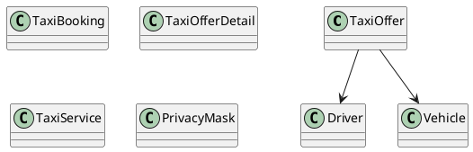

# UC-12 — View Taxi and Driver Details

### Description

As a traveller, I want to inspect a taxi offer, vehicle, and driver before reserving it.

### Actors

Traveller; Taxi Service.

### Priority

P0.

### Trigger

**TRG-UC-12-01** — The traveller chooses a taxi offer from a result view.

### Preconditions

- **PRE-UC-12-01** — A selected taxi-offer reference is available to the client.

### Postconditions

- **POST-UC-12-01** — The client displays the taxi-detail outcome returned by the system.
- **POST-UC-12-02** — Navigation back to the originating result context remains available.

### Basic Flow

1. The traveller selects a taxi offer.
2. The client requests the detail associated with the selected offer.
3. The system processes the request and returns a detail outcome.
4. The client renders the trip summary and returned detail sections.
5. The traveller reviews the displayed sections.
6. The traveller may use an available continuation from the detail view.

### Alternative Flows

#### AF-UC-12-01

1. The traveller returns to the preserved taxi-result context.

#### AF-UC-12-02

1. If an optional section is absent from the response, the client renders the remaining detail sections.

### Exception Flows

#### EF-UC-12-01

1. If the detail cannot be loaded, the client displays a retry state.
2. The client retains navigation back to the result view.

### UML Model

Classifiers and operations are defined in the [shared domain model](shared-domain-model.md).



### Business Rules

```ocl
-- BR-UC-12-01
-- Source: Assumption
context TaxiService::getOffer(offerId: String): TaxiOfferDetail
post BR_UC_12_01_DetailIsLiveOrAccessibleThroughOwnedConfirmedBooking:
  result <> null and result.offer.id = offerId and
  ((result.offer.available and result.offer.expiresAt > RequestContext::startedAt) or
   TaxiBooking.allInstances()->exists(b |
     b.user.id = RequestContext::authenticatedUserId and b.offer.id = offerId and
     b.status = BookingStatus::CONFIRMED))
```

```ocl
-- BR-UC-12-02
-- Source: Assumption
context TaxiService::getOffer(offerId: String): TaxiOfferDetail
post BR_UC_12_02_DetailUsesTheOffersAssignedResources:
  result.driver = result.offer.driver and result.vehicle = result.offer.vehicle and
  result.vehicle.seatCapacity >= result.offer.seats
```

```ocl
-- BR-UC-12-03
-- Source: Assumption
context TaxiService::getOffer(offerId: String): TaxiOfferDetail
post BR_UC_12_03_DriverContactRequiresOwnedConfirmedBooking:
  let authorized: Boolean =
    TaxiBooking.allInstances()->exists(b |
      b.user.id = RequestContext::authenticatedUserId and
      b.offer.id = offerId and b.status = BookingStatus::CONFIRMED) in
  (authorized and result.displayedDriverPhone = result.driver.phone) or
  (not authorized and
    result.displayedDriverPhone = PrivacyMask::phone(result.driver.phone))
```

```ocl
-- BR-UC-12-04
-- Source: Assumption
context TaxiService::getOffer(offerId: String): TaxiOfferDetail
post BR_UC_12_04_PublicVehicleIdentityIsMasked:
  result.displayedRegistration =
    PrivacyMask::registration(result.vehicle.registrationNumber)
```

```ocl
-- BR-UC-12-05
-- Source: Assumption
context TaxiService::getOffer(offerId: String): TaxiOfferDetail
post BR_UC_12_05_DetailRetrievalDoesNotAllocateTheOffer:
  ReadState::taxiBookings() = ReadState::taxiBookings()@pre
```

```ocl
-- BR-UC-12-06
-- Source: Assumption
context TaxiService::getOffer(offerId: String): TaxiOfferDetail
post BR_UC_12_06_DisplayedJourneyHasPositiveDuration:
  result.offer.dropoffAt > result.offer.pickupAt and result.offer.pickup.id <> result.offer.dropoff.id
```

```ocl
-- BR-UC-12-07
-- Source: Assumption
context TaxiService::getOffer(offerId: String): TaxiOfferDetail
post BR_UC_12_07_DisplayedFareIsNonnegativeAndCurrencyIdentified:
  result.offer.total.amount >= 0 and Validation::isCurrency(result.offer.total.currency)
```

### Related UI

`Bajaj Details`.

### Related APIs

`API-TAXI-OFFER-DETAIL`.
