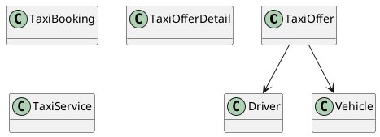

# UC-12 — View Taxi Rental and Driver Details

### Description

As a traveller, I want to inspect the selected vehicle, assigned driver, rental period, allowance, and price before reserving it.

### Actors

Traveller; Taxi Rental Service.

### Priority

P0.

### Trigger

**TRG-UC-12-01** — The traveller chooses View Details for a Taxi offer.

### Preconditions

- **PRE-UC-12-01** — A selected Taxi offer reference is available to the client.

### Postconditions

- **POST-UC-12-01** — The client displays the Taxi rental detail outcome returned by the system.
- **POST-UC-12-02** — Navigation back to the originating result context remains available.

### Basic Flow

1. The traveller selects View Details for a Taxi offer.
2. The client requests the detail associated with the selected offer.
3. The system processes the request and returns a detail outcome.
4. The client renders the vehicle, driver, pick-up and drop-off schedule, allowance, and price sections.
5. The traveller reviews the displayed sections.
6. The traveller may continue to the reservation form.

### Alternative Flows

#### AF-UC-12-01

1. The traveller returns to the preserved Taxi result context.

#### AF-UC-12-02

1. If an optional section is absent from the response, the client renders the remaining detail sections.

### Exception Flows

#### EF-UC-12-01

1. If the detail cannot be loaded, the client displays a retry state.
2. The client retains navigation back to the result view.

### UML Model

Classifiers and operations are defined in the [shared domain model](shared-domain-model.md).



### Business Rules

```ocl
-- BR-UC-12-01
-- Source: Assumption
context TaxiService::getOffer(offerId: String): TaxiOfferDetail
post BR_UC_12_01_DetailIsLiveOrAccessibleThroughOwnedBooking:
  result <> null and result.offer.id = offerId and
  ((result.offer.available and result.offer.expiresAt > RequestContext::startedAt) or
   TaxiBooking.allInstances()->exists(b |
     b.user.id = RequestContext::authenticatedUserId and b.offer.id = offerId and
     Set{BookingStatus::PENDING, BookingStatus::CONFIRMED}->includes(b.status)))
```

```ocl
-- BR-UC-12-02
-- Source: Figma
context TaxiService::getOffer(offerId: String): TaxiOfferDetail
post BR_UC_12_02_DetailUsesTheOffersAssignedResources:
  result.driver = result.offer.driver and result.vehicle = result.offer.vehicle and
  result.vehicle.seatCapacity >= result.offer.passengers
```

```ocl
-- BR-UC-12-03
-- Source: Figma
context TaxiService::getOffer(offerId: String): TaxiOfferDetail
post BR_UC_12_03_DriverContactMatchesTheDisplayedAssignment:
  result.displayedDriverPhone = result.driver.phone
```

```ocl
-- BR-UC-12-04
-- Source: Figma
context TaxiService::getOffer(offerId: String): TaxiOfferDetail
post BR_UC_12_04_VehicleRegistrationMatchesTheDisplayedVehicle:
  result.displayedRegistration = result.vehicle.registrationNumber
```

```ocl
-- BR-UC-12-05
-- Source: Assumption
context TaxiService::getOffer(offerId: String): TaxiOfferDetail
post BR_UC_12_05_DetailRetrievalDoesNotAllocateTheOffer:
  ReadState::taxiBookings() = ReadState::taxiBookings()@pre
```

```ocl
-- BR-UC-12-06
-- Source: Figma
context TaxiService::getOffer(offerId: String): TaxiOfferDetail
post BR_UC_12_06_DisplayedRentalUsesOneLocationAndPositiveDuration:
  result.offer.location.id = result.offer.locationId and result.offer.dropoffAt > result.offer.pickupAt
```

```ocl
-- BR-UC-12-07
-- Source: Figma
context TaxiService::getOffer(offerId: String): TaxiOfferDetail
post BR_UC_12_07_DisplayedCommercialFactsAreCoherent:
  result.offer.total.amount >= 0 and result.offer.deposit.amount >= 0 and
  result.offer.total.currency = result.offer.deposit.currency and
  result.offer.mileageAllowanceKm >= 0 and result.offer.rating >= 0 and result.offer.rating <= 5
```

### Related UI

`Bajaj Details`; `Your Deal`; driver card; vehicle details; `Pick-up and drop-off`; price summary.

### Related APIs

`API-TAXI-OFFER-DETAIL`.
