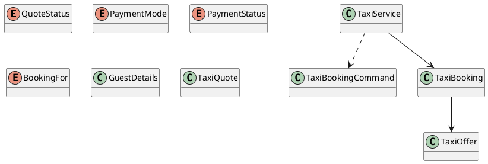

# UC-13 — Book a Taxi Rental

### Description

As an authenticated traveller, I want to confirm a vehicle-and-driver rental and provide the contact and booking details shown at checkout.

### Actors

Authenticated Traveller; Taxi Rental Service; Payment Provider or Driver Payment Process.

### Priority

P0.

### Trigger

**TRG-UC-13-01** — The traveller chooses to continue from a Taxi offer to the reservation form.

### Preconditions

- **PRE-UC-13-01** — The traveller is viewing checkout for a selected Taxi offer context.

### Postconditions

- **POST-UC-13-01** — The client displays the reservation outcome returned by the system.
- **POST-UC-13-02** — The interface exposes the returned continuation, including driver follow-up information when available.

### Basic Flow

1. The traveller opens the reservation form from a selected Taxi offer.
2. The client requests a checkout summary for the current context.
3. The system processes the request and returns the checkout-summary outcome.
4. The client presents the driver, vehicle, schedule, price, contact, booking-party, work-travel, payment, and save-card controls.
5. The traveller reviews the summary, completes the displayed controls, and selects Confirm Your Reservation.
6. The client submits the confirmation request.
7. The system processes the request and returns a reservation outcome.
8. The client renders the returned outcome, including the displayed driver-contact and SMS continuation.

### Alternative Flows

#### AF-UC-13-01

1. The traveller chooses the displayed pay-the-driver option and submits the reservation.

#### AF-UC-13-02

1. The traveller indicates that the reservation is for someone else and completes the displayed guest details.

#### AF-UC-13-03

1. If a refreshed checkout summary is returned, the client presents it for review before confirmation.

### Exception Flows

#### EF-UC-13-01

1. After a recoverable reservation outcome, the client retains the entered details and displays the supplied recovery action.

#### EF-UC-13-02

1. If the client receives no confirmation response, it displays a retry state.
2. The traveller chooses retry and the client resubmits the confirmation request.
3. The client displays the returned reservation outcome.

### UML Model

Classifiers and operations are defined in the [shared domain model](shared-domain-model.md).



### Business Rules

```ocl
-- BR-UC-13-01
-- Source: Assumption
context TaxiService::book(command: TaxiBookingCommand): TaxiBooking
pre BR_UC_13_01_NewReservationUsesLiveQuoteOrReplaysExistingIntent:
  let prior = TaxiBooking.allInstances()->select(b |
    b.user.id = RequestContext::authenticatedUserId and b.idempotencyKey = command.idempotencyKey) in
  if prior->notEmpty() then
    prior->one(b | b.requestFingerprint = command.requestFingerprint and b.quote.id = command.quoteId)
  else
    TaxiQuote.allInstances()->one(q |
      q.id = command.quoteId and q.user.id = RequestContext::authenticatedUserId and
      q.status = QuoteStatus::ACTIVE and q.expiresAt > RequestContext::startedAt and
      q.offer.available and q.offer.expiresAt > RequestContext::startedAt and
      q.offer.version = q.offerVersion and q.offer.driver.active and q.offer.vehicle.active and
      AllocationCalendar::isFree(q.offer.driver.id, q.offer.vehicle.id, q.offer.pickupAt, q.offer.dropoffAt)) and
    TaxiBooking.allInstances()->forAll(b | b.quote.id <> command.quoteId)
  endif
```

```ocl
-- BR-UC-13-02
-- Source: Assumption
context TaxiService::book(command: TaxiBookingCommand): TaxiBooking
pre BR_UC_13_02_FingerprintIsServerDerivedAndKeyMatchesIntent:
  command.idempotencyKey.trim().size() > 0 and
  command.requestFingerprint = RequestFingerprint::ofTaxi(command) and
  TaxiBooking.allInstances()->select(b |
    b.user.id = RequestContext::authenticatedUserId and b.idempotencyKey = command.idempotencyKey)
    ->forAll(b | b.requestFingerprint = command.requestFingerprint)
```

```ocl
-- BR-UC-13-03
-- Source: Assumption
context TaxiService::book(command: TaxiBookingCommand): TaxiBooking
pre BR_UC_13_03_GuestAndAuthenticatedOwnerAreUsable:
  User.allInstances()->one(u | u.id = RequestContext::authenticatedUserId and u.active) and
  command.guest.firstName.trim().size() > 0 and command.guest.lastName.trim().size() > 0 and
  command.guest.homeAddress.trim().size() > 0 and Validation::isEmail(command.guest.email) and
  Validation::isPhone(command.guest.phone) and Validation::isCountryCode(command.guest.countryCode)
```

```ocl
-- BR-UC-13-04
-- Source: Figma
context TaxiService::book(command: TaxiBookingCommand): TaxiBooking
pre BR_UC_13_04_PaymentInputMatchesTheSelectedMode:
  TaxiQuote.allInstances()->one(q | q.id = command.quoteId and
    ((q.paymentMode = PaymentMode::PAY_DRIVER and command.paymentToken = null and not command.savePaymentMethod) or
     (q.paymentMode = PaymentMode::ONLINE and command.paymentToken <> null and
      command.paymentToken.trim().size() > 0)))
```

```ocl
-- BR-UC-13-05
-- Source: Assumption
context TaxiService::book(command: TaxiBookingCommand): TaxiBooking
post BR_UC_13_05_ReservationIsBoundToQuoteOfferAndOwner:
  result.user.id = RequestContext::authenticatedUserId and result.quote.id = command.quoteId and
  result.offer = result.quote.offer and result.driver = result.offer.driver and
  result.vehicle = result.offer.vehicle and
  TaxiBooking.allInstances()->select(b | b.quote.id = command.quoteId)->size() = 1
```

```ocl
-- BR-UC-13-06
-- Source: Figma
context TaxiService::book(command: TaxiBookingCommand): TaxiBooking
post BR_UC_13_06_ReservationRetainsTheDisplayedCheckoutDetails:
  result.guest.firstName = command.guest.firstName and result.guest.lastName = command.guest.lastName and
  result.guest.homeAddress = command.guest.homeAddress and result.guest.email = command.guest.email and
  result.guest.phone = command.guest.phone and result.guest.countryCode = command.guest.countryCode and
  result.guest.bookingFor = command.guest.bookingFor and result.guest.workTravel = command.guest.workTravel
```

```ocl
-- BR-UC-13-07
-- Source: Assumption
context TaxiService::book(command: TaxiBookingCommand): TaxiBooking
post BR_UC_13_07_CommercialTermsComeFromTheQuote:
  result.total.amount = result.quote.total.amount and result.total.currency = result.quote.total.currency and
  result.quote.paymentMode = result.offer.paymentMode
```

```ocl
-- BR-UC-13-08
-- Source: Assumption
context TaxiService::book(command: TaxiBookingCommand): TaxiBooking
post BR_UC_13_08_QuoteIsConsumedWithOneReservation:
  result.quote.status = QuoteStatus::CONSUMED and
  TaxiBooking.allInstances()->select(b |
    b.user.id = RequestContext::authenticatedUserId and b.idempotencyKey = command.idempotencyKey)->size() = 1
```

```ocl
-- BR-UC-13-09
-- Source: Figma
context TaxiService::book(command: TaxiBookingCommand): TaxiBooking
post BR_UC_13_09_InitialStateMatchesThePaymentMode:
  (result.quote.paymentMode = PaymentMode::PAY_DRIVER implies
    result.paymentReference = null and result.status = BookingStatus::CONFIRMED) and
  (result.quote.paymentMode = PaymentMode::ONLINE implies
    result.paymentReference <> null and
    ((result.paymentReference.status = PaymentStatus::AUTHORIZED and result.status = BookingStatus::CONFIRMED) or
     (result.paymentReference.status = PaymentStatus::PENDING and result.status = BookingStatus::PENDING)))
```

```ocl
-- BR-UC-13-10
-- Source: Assumption
context TaxiService::book(command: TaxiBookingCommand): TaxiBooking
post BR_UC_13_10_ReplayReturnsOriginalReservationWithoutNewEffects:
  let prior = TaxiBooking.allInstances()@pre->select(b |
    b.user.id = RequestContext::authenticatedUserId and b.idempotencyKey = command.idempotencyKey) in
  result.idempotencyKey = command.idempotencyKey and result.requestFingerprint = command.requestFingerprint and
  (if prior->notEmpty() then
    result = prior->any(b | true) and ReadState::taxiBookings() = ReadState::taxiBookings()@pre and
    ReadState::payments() = ReadState::payments()@pre
   else result.oclIsNew() and
    TaxiBooking.allInstances()->size() = TaxiBooking.allInstances()@pre->size() + 1 endif)
```

```ocl
-- BR-UC-13-11
-- Source: Assumption
context TaxiService::book(command: TaxiBookingCommand): TaxiBooking
post BR_UC_13_11_OnlinePaymentStoresOnlyADerivedReference:
  result.paymentReference <> null implies
    result.paymentReference.tokenFingerprint = PaymentFingerprint::of(command.paymentToken) and
    result.paymentReference.tokenFingerprint <> command.paymentToken
```

```ocl
-- BR-UC-13-12
-- Source: Figma
context TaxiService::book(command: TaxiBookingCommand): TaxiBooking
post BR_UC_13_12_SaveCardChoiceControlsTheSavedProviderReference:
  (command.savePaymentMethod implies
    result.savedPaymentMethod <> null and result.savedPaymentMethod.user = result.user and
    result.savedPaymentMethod.providerReference <> command.paymentToken) and
  (not command.savePaymentMethod implies result.savedPaymentMethod = null)
```

```ocl
-- BR-UC-13-13
-- Source: Assumption
context TaxiService::book(command: TaxiBookingCommand): TaxiBooking
post BR_UC_13_13_NewReservationClaimsDriverAndVehicleForThePeriod:
  result.oclIsNew() implies
    TaxiBooking.allInstances()->forAll(b |
      b = result or Set{BookingStatus::FAILED, BookingStatus::CANCELLED}->includes(b.status) or
      (b.driver <> result.driver and b.vehicle <> result.vehicle) or
      b.offer.dropoffAt <= result.offer.pickupAt or result.offer.dropoffAt <= b.offer.pickupAt)
```

```ocl
-- BR-UC-13-14
-- Source: Assumption
context TaxiService::quote(offerId: String): TaxiQuote
post BR_UC_13_14_IssuedQuoteCapturesTheRentalOffer:
  result.oclIsNew() and result.offer.id = offerId and result.user.id = RequestContext::authenticatedUserId and
  result.offerVersion = result.offer.version and result.status = QuoteStatus::ACTIVE and result.available and
  result.total = result.offer.total and result.deposit = result.offer.deposit and
  result.paymentMode = result.offer.paymentMode and
  result.expiresAt > RequestContext::startedAt and result.expiresAt <= result.offer.expiresAt
```

```ocl
-- BR-UC-13-15
-- Source: Assumption
context TaxiService::quote(offerId: String): TaxiQuote
post BR_UC_13_15_QuoteDoesNotAllocateOrCharge:
  TaxiBooking.allInstances() = TaxiBooking.allInstances()@pre and
  ReadState::payments() = ReadState::payments()@pre
```

### Related UI

`Bajaj Details`; `taxi checkoutmobile`; `Enter your details`; `Who are you booking for?`; `Are you travelling for work?`; `No Need to Pay Now!`; `Confirm Your Reservation`; `Your Driver Will Reach Out`.

### Related APIs

`API-TAXI-QUOTE`; `API-TAXI-BOOKING-CREATE`.
