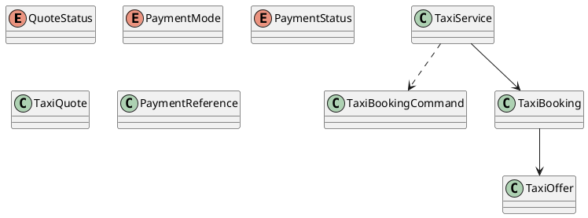

# UC-13 — Book a Taxi

### Description

As an authenticated traveller, I want to confirm a taxi offer and provide contact details.

### Actors

Authenticated Traveller; Taxi Service; Payment Provider or Driver Payment Process.

### Priority

P0.

### Trigger

**TRG-UC-13-01** — The traveller chooses to continue from a taxi offer to checkout.

### Preconditions

- **PRE-UC-13-01** — The traveller is viewing checkout for a selected taxi-offer context.

### Postconditions

- **POST-UC-13-01** — The client displays the checkout outcome returned by the system.
- **POST-UC-13-02** — The interface exposes the continuation supplied with that outcome.

### Basic Flow

1. The traveller opens checkout from a selected taxi offer.
2. The client requests a checkout summary for the current context.
3. The system processes the request and returns a checkout-summary outcome.
4. The client presents the returned summary and booking-data controls.
5. The traveller reviews the summary, completes the displayed controls, and confirms.
6. The client submits the confirmation request.
7. The system processes the request and returns a booking outcome.
8. The client renders the returned outcome and its available continuation.

### Alternative Flows

#### AF-UC-13-01

1. If a refreshed checkout summary is returned, the client presents it for review before confirmation.

#### AF-UC-13-02

1. After a recoverable outcome, the traveller uses one of the displayed recovery actions.

### Exception Flows

#### EF-UC-13-01

1. If the client receives no confirmation response, it displays a retry state.
2. The traveller chooses retry and the client resubmits the confirmation request.
3. The client displays the returned booking outcome.

### UML Model

Classifiers and operations are defined in the [shared domain model](shared-domain-model.md).



### Business Rules

```ocl
-- BR-UC-13-01
-- Source: Assumption
context TaxiService::book(command: TaxiBookingCommand): TaxiBooking
pre BR_UC_13_01_NewBookingUsesLiveQuoteOrReplaysExistingIntent:
  let prior = TaxiBooking.allInstances()->select(b |
    b.user.id = RequestContext::authenticatedUserId and b.idempotencyKey = command.idempotencyKey) in
  if prior->notEmpty() then
    prior->one(b | b.requestFingerprint = command.requestFingerprint and b.quote.id = command.quoteId)
  else
    TaxiQuote.allInstances()->one(q |
      q.id = command.quoteId and q.user.id = RequestContext::authenticatedUserId and
      q.status = QuoteStatus::ACTIVE and q.expiresAt > RequestContext::startedAt and
      q.offer.available and q.offer.expiresAt > RequestContext::startedAt and
      q.offer.driver.active and q.offer.vehicle.active and
      q.offer.version = q.offerVersion) and
    TaxiBooking.allInstances()->forAll(b | b.quote.id <> command.quoteId)
  endif
```

```ocl
-- BR-UC-13-02
-- Source: Assumption
context TaxiService::book(command: TaxiBookingCommand): TaxiBooking
pre BR_UC_13_02_PaymentCredentialMatchesTheQuotedMode:
  let quote: TaxiQuote =
    TaxiQuote.allInstances()->any(q | q.id = command.quoteId) in
  (quote.paymentMode = PaymentMode::PAY_DRIVER implies
    command.paymentToken = null) and
  (quote.paymentMode = PaymentMode::ONLINE implies
    command.paymentToken <> null and command.paymentToken.trim().size() > 0)
```

```ocl
-- BR-UC-13-03
-- Source: Assumption
context TaxiService::book(command: TaxiBookingCommand): TaxiBooking
pre BR_UC_13_03_FingerprintIsServerDerivedAndKeyMatchesIntent:
  command.idempotencyKey.trim().size() > 0 and
  command.requestFingerprint = RequestFingerprint::ofTaxi(command) and
  TaxiBooking.allInstances()->select(b |
    b.user.id = RequestContext::authenticatedUserId and b.idempotencyKey = command.idempotencyKey)
    ->forAll(b | b.requestFingerprint = command.requestFingerprint)
```

```ocl
-- BR-UC-13-04
-- Source: Assumption
context TaxiService::book(command: TaxiBookingCommand): TaxiBooking
post BR_UC_13_04_BookingIsOwnedAndBoundToOneQuote:
  result.user.id = RequestContext::authenticatedUserId and
  result.quote.id = command.quoteId and
  TaxiBooking.allInstances()->select(b |
    b.quote.id = command.quoteId)->size() = 1
```

```ocl
-- BR-UC-13-05
-- Source: Assumption
context TaxiService::book(command: TaxiBookingCommand): TaxiBooking
post BR_UC_13_05_AllocatedDriverAndVehicleAreExclusive:
  result.driver = result.offer.driver and result.vehicle = result.offer.vehicle and
  (Set{BookingStatus::PENDING, BookingStatus::CONFIRMED}->includes(result.status) implies
   TaxiBooking.allInstances()->excluding(result)->forAll(b |
    (Set{BookingStatus::PENDING, BookingStatus::CONFIRMED}->includes(b.status) and
     (b.driver = result.driver or b.vehicle = result.vehicle)) implies
    (b.offer.dropoffAt <= result.offer.pickupAt or b.offer.pickupAt >= result.offer.dropoffAt)))
```

```ocl
-- BR-UC-13-06
-- Source: Assumption
context TaxiService::book(command: TaxiBookingCommand): TaxiBooking
post BR_UC_13_06_PersistedCommercialTermsComeFromTheQuote:
  result.offer = result.quote.offer and
  result.total.amount = result.quote.total.amount and
  result.total.currency = result.quote.total.currency and
  result.quote.status = QuoteStatus::CONSUMED
```

```ocl
-- BR-UC-13-07
-- Source: Assumption
context TaxiService::book(command: TaxiBookingCommand): TaxiBooking
post BR_UC_13_07_InitialStateRespectsPaymentMode:
  result.oclIsNew() implies
   ((result.quote.paymentMode = PaymentMode::PAY_DRIVER and
     result.paymentReference = null and result.status = BookingStatus::CONFIRMED) or
    (result.quote.paymentMode = PaymentMode::ONLINE and result.paymentReference <> null and
     ((result.paymentReference.status = PaymentStatus::AUTHORIZED and result.status = BookingStatus::CONFIRMED) or
      (result.paymentReference.status = PaymentStatus::PENDING and result.status = BookingStatus::PENDING))))
```

```ocl
-- BR-UC-13-08
-- Source: Assumption
context TaxiService::book(command: TaxiBookingCommand): TaxiBooking
post BR_UC_13_08_PaymentReferenceContainsOnlyDerivedTokenFingerprint:
  result.paymentReference <> null implies
    result.paymentReference.tokenFingerprint = PaymentFingerprint::of(command.paymentToken) and
    result.paymentReference.tokenFingerprint <> command.paymentToken
```

```ocl
-- BR-UC-13-09
-- Source: Assumption
context TaxiService::book(command: TaxiBookingCommand): TaxiBooking
pre BR_UC_13_09_NewBookingClaimsFreeResources:
  TaxiBooking.allInstances()->forAll(b |
    b.user.id <> RequestContext::authenticatedUserId or b.idempotencyKey <> command.idempotencyKey) implies
   TaxiQuote.allInstances()->one(q | q.id = command.quoteId and
    AllocationCalendar::isFree(q.offer.driver.id, q.offer.vehicle.id, q.offer.pickupAt, q.offer.dropoffAt))
```

```ocl
-- BR-UC-13-10
-- Source: Assumption
context TaxiService::book(command: TaxiBookingCommand): TaxiBooking
post BR_UC_13_10_ReplayReturnsOriginalBookingWithoutNewEffects:
  let prior = TaxiBooking.allInstances()@pre->select(b |
    b.user.id = RequestContext::authenticatedUserId and b.idempotencyKey = command.idempotencyKey) in
  result.idempotencyKey = command.idempotencyKey and
  result.requestFingerprint = command.requestFingerprint and
  (if prior->notEmpty() then
    result = prior->any(b | true) and
    ReadState::taxiBookings() = ReadState::taxiBookings()@pre and
    ReadState::payments() = ReadState::payments()@pre
  else
    result.oclIsNew() and
    TaxiBooking.allInstances()->size() = TaxiBooking.allInstances()@pre->size() + 1
  endif)
```

```ocl
-- BR-UC-13-11
-- Source: Assumption
context TaxiService::quote(offerId: String): TaxiQuote
pre BR_UC_13_11_QuoteRequiresAuthenticatedUserAndLiveOffer:
  User.allInstances()->one(u | u.id = RequestContext::authenticatedUserId and u.active) and
  TaxiOffer.allInstances()->one(o |
    o.id = offerId and o.available and o.expiresAt > RequestContext::startedAt)
```

```ocl
-- BR-UC-13-12
-- Source: Assumption
context TaxiService::quote(offerId: String): TaxiQuote
post BR_UC_13_12_IssuedQuoteCapturesRevalidatedOfferTerms:
  result.oclIsNew() and result.offer.id = offerId and
  result.user.id = RequestContext::authenticatedUserId and
  result.offerVersion = result.offer.version and result.status = QuoteStatus::ACTIVE and
  result.available and result.total = result.offer.total and
  result.expiresAt > RequestContext::startedAt and result.expiresAt <= result.offer.expiresAt and
  result.paymentMode = result.offer.paymentMode
```

```ocl
-- BR-UC-13-13
-- Source: Assumption
context TaxiService::book(command: TaxiBookingCommand): TaxiBooking
pre BR_UC_13_13_GuestContactAndAuthenticatedOwnerAreUsable:
  User.allInstances()->one(u | u.id = RequestContext::authenticatedUserId and u.active) and
  command.guest.firstName.trim().size() > 0 and command.guest.lastName.trim().size() > 0 and
  Validation::isEmail(command.guest.email) and Validation::isPhone(command.guest.phone) and
  Validation::isCountryCode(command.guest.countryCode)
```

```ocl
-- BR-UC-13-14
-- Source: Assumption
context TaxiService::quote(offerId: String): TaxiQuote
post BR_UC_13_14_QuoteDoesNotReserveInventoryOrAuthorizePayment:
  TaxiBooking.allInstances() = TaxiBooking.allInstances()@pre and
  ReadState::payments() = ReadState::payments()@pre and
  ProviderInventory::reservations() = ProviderInventory::reservations()@pre
```

```ocl
-- BR-UC-13-15
-- Source: Assumption
context TaxiService::book(command: TaxiBookingCommand): TaxiBooking
post BR_UC_13_15_BookingRetainsTheSubmittedGuestContact:
  result.guest.firstName = command.guest.firstName and result.guest.lastName = command.guest.lastName and
  result.guest.email = command.guest.email and result.guest.phone = command.guest.phone and
  result.guest.countryCode = command.guest.countryCode
```

### Related UI

`Bajaj Details`; `taxi checkoutmobile`.

### Related APIs

`API-TAXI-QUOTE`; `API-TAXI-BOOKING-CREATE`.
