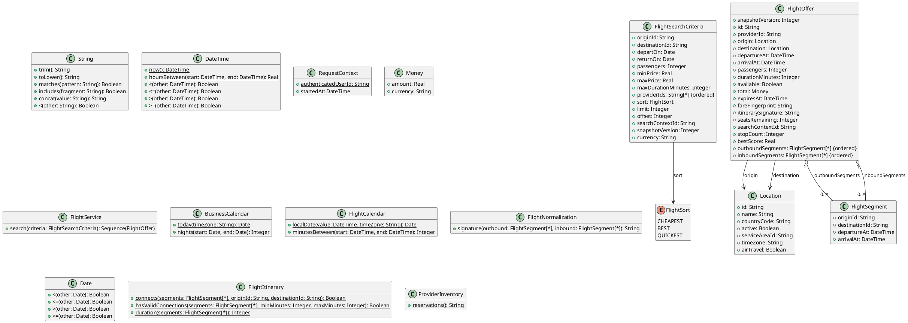

# UC-14 — Search for Flights

### Description

As a traveller, I want to search for flights by route, dates, and passenger count.

### Actors

Traveller; Flight Service; External Flight Provider.

### Priority

P0.

### Trigger

**TRG-UC-14-01** — The traveller chooses to search for flights.

### Preconditions

- **PRE-UC-14-01** — The traveller can access the flight-search interface.

### Postconditions

- **POST-UC-14-01** — The client displays the flight-search outcome returned by the system.
- **POST-UC-14-02** — The entered search context remains available for the next interaction.

### Basic Flow

1. The traveller opens the flight-search interface.
2. The client presents route, trip-schedule, and passenger controls.
3. The traveller completes or revises the criteria and submits the search.
4. The client sends the selected criteria to the flight-search API.
5. The system processes the request and returns a search outcome.
6. The client renders the returned outcome and its available continuation.

### Alternative Flows

#### AF-UC-14-01

1. The traveller switches between the trip options exposed by the interface before submitting.

#### AF-UC-14-02

1. From flight results, the traveller reopens the search controls, revises the criteria, and submits a replacement search.

### Exception Flows

#### EF-UC-14-01

1. If the response identifies a partial result, the client renders the supplied partial-result state.

#### EF-UC-14-02

1. If the search cannot be completed, the client preserves the criteria and displays a retry action.

### UML Model



### Business Rules

```ocl
-- BR-UC-14-01
-- Source: Assumption
context FlightService::search(criteria: FlightSearchCriteria): Sequence(FlightOffer)
pre BR_UC_14_01_RouteEndpointsAreActiveAirTravelLocations:
  Location.allInstances()->one(l | l.id = criteria.originId and l.active and l.airTravel) and
  Location.allInstances()->one(l | l.id = criteria.destinationId and l.active and l.airTravel)
```

```ocl
-- BR-UC-14-02
-- Source: Assumption
context FlightService::search(criteria: FlightSearchCriteria): Sequence(FlightOffer)
post BR_UC_14_02_EachJourneyConnectsItsRequestedEndpoints:
  result->forAll(o |
    FlightItinerary::connects(o.outboundSegments, criteria.originId, criteria.destinationId) and
    (if criteria.returnOn = null then o.inboundSegments->isEmpty()
     else FlightItinerary::connects(o.inboundSegments, criteria.destinationId, criteria.originId) endif))
```

```ocl
-- BR-UC-14-03
-- Source: Assumption
context FlightService::search(criteria: FlightSearchCriteria): Sequence(FlightOffer)
post BR_UC_14_03_ConnectionsRespectTheTransferWindowWithinEachJourney:
  result->forAll(o |
    FlightItinerary::hasValidConnections(o.outboundSegments, 45, 1440) and
    FlightItinerary::hasValidConnections(o.inboundSegments, 45, 1440))
```

```ocl
-- BR-UC-14-04
-- Source: Assumption
context FlightService::search(criteria: FlightSearchCriteria): Sequence(FlightOffer)
post BR_UC_14_04_JourneyDatesUseTheirDepartureLocalCalendars:
  let origin = Location.allInstances()->any(l | l.id = criteria.originId) in
  let destination = Location.allInstances()->any(l | l.id = criteria.destinationId) in
  result->forAll(o |
    FlightCalendar::localDate(o.outboundSegments->first().departureAt, origin.timeZone) = criteria.departOn and
    (criteria.returnOn <> null implies
      FlightCalendar::localDate(o.inboundSegments->first().departureAt, destination.timeZone) = criteria.returnOn and
      o.inboundSegments->first().departureAt > o.outboundSegments->last().arrivalAt))
```

```ocl
-- BR-UC-14-05
-- Source: Assumption
context FlightService::search(criteria: FlightSearchCriteria): Sequence(FlightOffer)
post BR_UC_14_05_OnlyLivePartySizedOffersAreSelectable:
  result->forAll(o |
    o.available and o.expiresAt > RequestContext::startedAt and
    o.seatsRemaining >= criteria.passengers)
```

```ocl
-- BR-UC-14-06
-- Source: Assumption
context FlightService::search(criteria: FlightSearchCriteria): Sequence(FlightOffer)
post BR_UC_14_06_ItineraryIdentityIsProviderNormalized:
  result->forAll(o |
    o.itinerarySignature = FlightNormalization::signature(o.outboundSegments, o.inboundSegments)) and
  result->isUnique(o | Tuple{provider = o.providerId, itinerary = o.itinerarySignature, fare = o.fareFingerprint})
```

```ocl
-- BR-UC-14-07
-- Source: Assumption
context FlightService::search(criteria: FlightSearchCriteria): Sequence(FlightOffer)
post BR_UC_14_07_SearchDoesNotReserveProviderInventory:
  ProviderInventory::reservations() = ProviderInventory::reservations()@pre
```

```ocl
-- BR-UC-14-08
-- Source: Assumption
context FlightService::search(criteria: FlightSearchCriteria): Sequence(FlightOffer)
pre BR_UC_14_08_RouteDatesAndPartyAreCoherent:
  criteria.originId <> criteria.destinationId and criteria.passengers >= 1 and
  criteria.departOn >= BusinessCalendar::today(Location.allInstances()->any(l | l.id = criteria.originId).timeZone) and
  (criteria.returnOn = null or criteria.returnOn >= criteria.departOn)
```

```ocl
-- BR-UC-14-09
-- Source: Assumption
context FlightService::search(criteria: FlightSearchCriteria): Sequence(FlightOffer)
post BR_UC_14_09_DurationAndStopsDescribeTheCompleteTrip:
  result->forAll(o |
    o.durationMinutes = FlightItinerary::duration(o.outboundSegments) + FlightItinerary::duration(o.inboundSegments) and
    o.stopCount = (o.outboundSegments->size() - 1).max(0) + (o.inboundSegments->size() - 1).max(0) and
    o.total.amount >= 0 and o.total.currency = criteria.currency)
```

### Related UI

`flights`; `flight destination`; `check in flight`; `check out flight`; `passengers`.

### Related APIs

`API-FLIGHT-SEARCH`.
