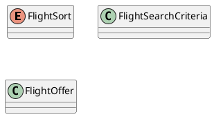

# UC-15 — View, Filter, and Sort Flight Results

### Description

As a traveller, I want to compare flight results by booking site, duration, price, and ranking.

### Actors

Traveller; Flight Service.

### Priority

P1.

### Trigger

**TRG-UC-15-01** — The client receives flight results or the traveller chooses to refine them.

### Preconditions

- **PRE-UC-15-01** — A flight-search result context is available to the client.

### Postconditions

- **POST-UC-15-01** — The client displays the flight-result outcome returned by the system.
- **POST-UC-15-02** — The search context remains available for another result interaction.

### Basic Flow

1. The client opens the flight-results view for the current search context.
2. The client displays the returned result summaries and comparison controls.
3. The traveller reviews the results or changes one or more displayed selections.
4. When selections change, the client submits the revised preferences with the current search context.
5. The system processes the request and returns a result outcome.
6. The client renders the returned offer presentations and selections.

### Alternative Flows

#### AF-UC-15-01

1. The traveller clears the displayed refinements and requests the base result view.

#### AF-UC-15-02

1. The traveller switches among the available sort views.

#### AF-UC-15-03

1. On mobile, the traveller dismisses pending filter changes without applying them.

### Exception Flows

#### EF-UC-15-01

1. If refreshed results cannot be loaded, the client keeps the previously displayed result state.

#### EF-UC-15-02

1. If the system returns an unusable-context outcome, the client presents the supplied recovery action.

### UML Model

Classifiers and operations are defined in the [shared domain model](shared-domain-model.md).



### Business Rules

```ocl
-- BR-UC-15-01
-- Source: Assumption
context FlightService::search(criteria: FlightSearchCriteria): Sequence(FlightOffer)
post BR_UC_15_01_RefinementCannotEscapeTheAcceptedSearch:
  result->forAll(o | (criteria.searchContextId = null or o.searchContextId = criteria.searchContextId))
```

```ocl
-- BR-UC-15-02
-- Source: Assumption
context FlightService::search(criteria: FlightSearchCriteria): Sequence(FlightOffer)
post BR_UC_15_02_AllAcceptedFiltersApplyTogether:
  result->forAll(o |
    (criteria.minPrice = null or o.total.amount >= criteria.minPrice) and
    (criteria.maxPrice = null or o.total.amount <= criteria.maxPrice) and
    (criteria.maxDurationMinutes = null or o.durationMinutes <= criteria.maxDurationMinutes) and
    (criteria.providerIds->isEmpty() or
      criteria.providerIds->includes(o.providerId)))
```

```ocl
-- BR-UC-15-03
-- Source: Assumption
context FlightService::search(criteria: FlightSearchCriteria): Sequence(FlightOffer)
post BR_UC_15_03_ResultPageHasNoDuplicateCommercialOffer:
  result->isUnique(o | o.id)
```

```ocl
-- BR-UC-15-04
-- Source: Assumption
context FlightService::search(criteria: FlightSearchCriteria): Sequence(FlightOffer)
post BR_UC_15_04_CheapestOrderUsesDurationAndIdentifierAsTieBreakers:
  criteria.sort = FlightSort::CHEAPEST implies
    (result->size() <= 1 or
      Sequence{1..result->size() - 1}->forAll(i |
        result->at(i).total.amount < result->at(i + 1).total.amount or
        (result->at(i).total.amount = result->at(i + 1).total.amount and
          (result->at(i).durationMinutes < result->at(i + 1).durationMinutes or
           (result->at(i).durationMinutes = result->at(i + 1).durationMinutes and
            result->at(i).id < result->at(i + 1).id)))))
```

```ocl
-- BR-UC-15-05
-- Source: Assumption
context FlightService::search(criteria: FlightSearchCriteria): Sequence(FlightOffer)
post BR_UC_15_05_QuickestOrderUsesStopsPriceAndIdentifierAsTieBreakers:
  criteria.sort = FlightSort::QUICKEST implies
    (result->size() <= 1 or
      Sequence{1..result->size() - 1}->forAll(i |
        result->at(i).durationMinutes < result->at(i + 1).durationMinutes or
        (result->at(i).durationMinutes = result->at(i + 1).durationMinutes and
          (result->at(i).stopCount < result->at(i + 1).stopCount or
           (result->at(i).stopCount = result->at(i + 1).stopCount and
             (result->at(i).total.amount < result->at(i + 1).total.amount or
              (result->at(i).total.amount = result->at(i + 1).total.amount and
                 result->at(i).id < result->at(i + 1).id)))))))
```

```ocl
-- BR-UC-15-06
-- Source: Assumption
context FlightService::search(criteria: FlightSearchCriteria): Sequence(FlightOffer)
post BR_UC_15_06_BestOrderUsesPublishedScoreWithStableTieBreak:
  criteria.sort = FlightSort::BEST implies
    (result->size() <= 1 or
      Sequence{1..result->size() - 1}->forAll(i |
        result->at(i).bestScore > result->at(i + 1).bestScore or
        (result->at(i).bestScore = result->at(i + 1).bestScore and
          result->at(i).id < result->at(i + 1).id)))
```

```ocl
-- BR-UC-15-07
-- Source: Assumption
context FlightService::search(criteria: FlightSearchCriteria): Sequence(FlightOffer)
pre BR_UC_15_07_OptionalFilterBoundsAreCoherent:
  (criteria.minPrice = null or criteria.minPrice >= 0) and
  (criteria.maxPrice = null or criteria.maxPrice >= 0) and
  (criteria.minPrice = null or criteria.maxPrice = null or criteria.minPrice <= criteria.maxPrice) and
  (criteria.maxDurationMinutes = null or criteria.maxDurationMinutes > 0) and
  criteria.limit > 0 and criteria.offset >= 0 and
  (SearchSnapshot::refinementChanged(criteria) implies criteria.offset = 0)
```

```ocl
-- BR-UC-15-08
-- Source: Assumption
context FlightService::search(criteria: FlightSearchCriteria): Sequence(FlightOffer)
pre BR_UC_15_08_ContinuationReferencesAUsableSnapshot:
  (criteria.searchContextId = null and criteria.snapshotVersion = null) or
  (criteria.searchContextId <> null and criteria.snapshotVersion <> null and
   SearchSnapshot::accepts(criteria, RequestContext::startedAt))
```

### Related UI

`flight details`; `flight list`; `flight filters mobile`.

### Related APIs

`API-FLIGHT-SEARCH`.

### Notes

Flight offer details and flight booking are intentionally outside the current scope because corresponding Figma frames are missing.
