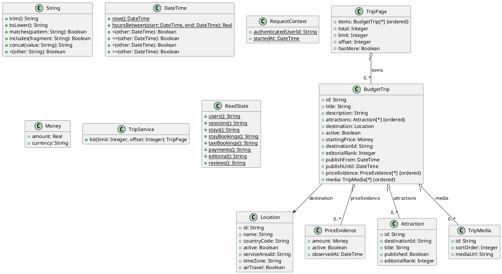

# UC-16 — Browse Budget Trips

### Description

As a traveller, I want to browse active budget-trip ideas so that I can choose an affordable destination.

### Actors

Traveller; Trip Service.

### Priority

P1.

### Trigger

**TRG-UC-16-01** — The traveller opens the budget-trips page.

### Preconditions

- **PRE-UC-16-01** — The traveller can access the budget-trips page.

### Postconditions

- **POST-UC-16-01** — The client displays the budget-trip page state returned by the system.
- **POST-UC-16-02** — Available navigation from the displayed content remains accessible.

### Basic Flow

1. The traveller opens the budget-trips page.
2. The client requests a page of budget-trip content.
3. The system processes the request and returns a page outcome.
4. The client renders the returned trip-card presentations.
5. The traveller may request another page or select a trip.

### Alternative Flows

#### AF-UC-16-01

1. If no trip content is returned, the client displays the designed empty state.

#### AF-UC-16-02

1. The client adapts the returned content to the active visual mode or device layout.

### Exception Flows

#### EF-UC-16-01

1. If another page cannot be loaded, the client keeps the displayed content and offers a retry.

#### EF-UC-16-02

1. If the initial request cannot be completed, the client displays the designed unavailable state.

### UML Model



### Business Rules

```ocl
-- BR-UC-16-01
-- Source: Assumption
context TripService::list(limit: Integer, offset: Integer): TripPage
post BR_UC_16_01_OnlyCurrentlyPublishedEditorialTripsAppear:
  result.items->forAll(t |
    t.active and t.publishFrom <= RequestContext::startedAt and
    (t.publishUntil = null or t.publishUntil > RequestContext::startedAt))
```

```ocl
-- BR-UC-16-02
-- Source: Assumption
context TripService::list(limit: Integer, offset: Integer): TripPage
post BR_UC_16_02_OneEditorialCardPerDestination:
  result.items->isUnique(t | t.destinationId)
```

```ocl
-- BR-UC-16-03
-- Source: Assumption
context TripService::list(limit: Integer, offset: Integer): TripPage
post BR_UC_16_03_IndicativePriceUsesRecentEvidenceInTheSameCurrency:
  result.items->forAll(t |
  let eligible = t.priceEvidence->select(e |
    e.active and e.amount.currency = t.startingPrice.currency and
    e.observedAt <= RequestContext::startedAt and
    DateTime::hoursBetween(e.observedAt, RequestContext::startedAt) <= 24) in
  eligible->notEmpty() and t.startingPrice.amount >= 0 and
  t.startingPrice.amount = eligible->collect(e | e.amount.amount)->min())
```

```ocl
-- BR-UC-16-04
-- Source: Assumption
context TripService::list(limit: Integer, offset: Integer): TripPage
post BR_UC_16_04_EditorialOrderHasStableTieBreak:
  result.items->size() <= 1 or
  Sequence{1..result.items->size() - 1}->forAll(i |
   result.items->at(i).editorialRank < result.items->at(i + 1).editorialRank or
   (result.items->at(i).editorialRank = result.items->at(i + 1).editorialRank and
    result.items->at(i).id < result.items->at(i + 1).id))
```

```ocl
-- BR-UC-16-05
-- Source: Assumption
context TripService::list(limit: Integer, offset: Integer): TripPage
post BR_UC_16_05_PageMetadataMatchesItsSlice:
  result.limit = limit and result.offset = offset and result.total >= 0 and
  result.items->size() = (result.total - offset).max(0).min(limit) and
  result.hasMore = (offset + result.items->size() < result.total)
```

```ocl
-- BR-UC-16-06
-- Source: Assumption
context TripService::list(limit: Integer, offset: Integer): TripPage
post BR_UC_16_06_BrowsingEditorialContentIsReadOnly:
  ReadState::editorial() = ReadState::editorial()@pre
```

```ocl
-- BR-UC-16-07
-- Source: Assumption
context TripService::list(limit: Integer, offset: Integer): TripPage
pre BR_UC_16_07_PageRequestHasUsableBounds:
  limit > 0 and offset >= 0
```

### Related UI

`budget trips main page`; `budget trips mobile`; `budget trips dark mode`.

### Related APIs

`API-BUDGET-TRIP-LIST`.
