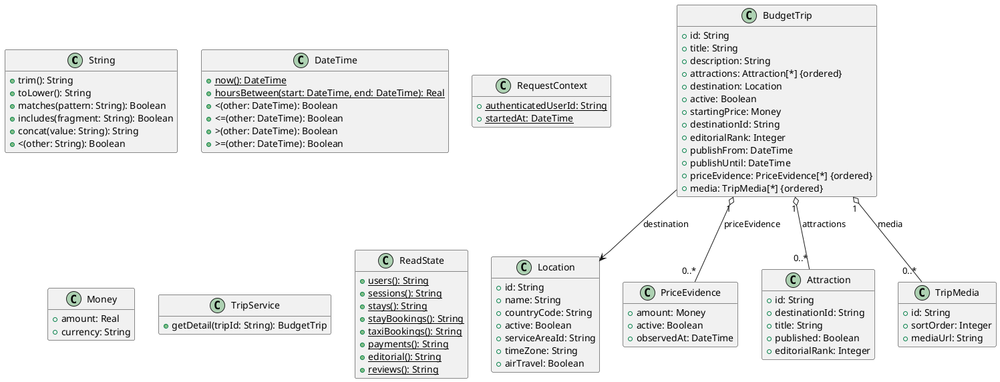

# UC-17 — View Budget Trip Details

### Description

As a traveller, I want to view the content, attractions, location, and starting price of a budget trip.

### Actors

Traveller; Trip Service.

### Priority

P1.

### Trigger

**TRG-UC-17-01** — The traveller chooses a budget trip from a supported entry point.

### Preconditions

- **PRE-UC-17-01** — A selected budget-trip reference is available to the client.

### Postconditions

- **POST-UC-17-01** — The client displays the trip-detail outcome returned by the system.
- **POST-UC-17-02** — Navigation back to the originating trip list remains available.

### Basic Flow

1. The traveller selects a budget-trip card.
2. The client requests the detail associated with the selected trip.
3. The system processes the request and returns a detail outcome.
4. The client renders the trip-detail sections represented by the response.
5. The traveller reviews the displayed sections.
6. The traveller may return to the preserved budget-trip list.

### Alternative Flows

#### AF-UC-17-01

1. If an optional section is absent from the response, the client renders the remaining trip-detail sections.

#### AF-UC-17-02

1. The client adapts the returned content to the active device layout.

### Exception Flows

#### EF-UC-17-01

1. If trip detail cannot be loaded, the client displays a retry state.
2. The client retains navigation back to the trip list.

### UML Model



### Business Rules

```ocl
-- BR-UC-17-01
-- Source: Assumption
context TripService::getDetail(tripId: String): BudgetTrip
post BR_UC_17_01_DetailRepresentsACurrentlyPublishedTrip:
  result <> null and result.id = tripId and result.active and
  result.publishFrom <= RequestContext::startedAt and
  (result.publishUntil = null or result.publishUntil > RequestContext::startedAt)
```

```ocl
-- BR-UC-17-02
-- Source: Assumption
context TripService::getDetail(tripId: String): BudgetTrip
post BR_UC_17_02_AttractionsBelongToTheTripDestination:
  result.attractions->forAll(a |
    a.published and a.destinationId = result.destinationId) and
  result.attractions->isUnique(a | a.id)
```

```ocl
-- BR-UC-17-03
-- Source: Assumption
context TripService::getDetail(tripId: String): BudgetTrip
post BR_UC_17_03_AttractionOrderIsEditoriallyStable:
  result.attractions->size() <= 1 or
  Sequence{1..result.attractions->size() - 1}->forAll(i |
    result.attractions->at(i).editorialRank <
      result.attractions->at(i + 1).editorialRank)
```

```ocl
-- BR-UC-17-04
-- Source: Assumption
context TripService::getDetail(tripId: String): BudgetTrip
post BR_UC_17_04_IndicativePriceUsesRecentEvidenceInTheSameCurrency:
  let eligible = result.priceEvidence->select(e |
    e.active and e.amount.currency = result.startingPrice.currency and
    e.observedAt <= RequestContext::startedAt and
    DateTime::hoursBetween(e.observedAt, RequestContext::startedAt) <= 24) in
  eligible->notEmpty() and result.startingPrice.amount >= 0 and
  result.startingPrice.amount = eligible->collect(e | e.amount.amount)->min()
```

```ocl
-- BR-UC-17-05
-- Source: Assumption
context TripService::getDetail(tripId: String): BudgetTrip
post BR_UC_17_05_EditorialDetailRetrievalIsReadOnly:
  ReadState::editorial() = ReadState::editorial()@pre
```

```ocl
-- BR-UC-17-06
-- Source: Assumption
context TripService::getDetail(tripId: String): BudgetTrip
post BR_UC_17_06_PublishedTripHasReadableContent:
  result.title.trim().size() > 0 and result.description.trim().size() > 0
```

```ocl
-- BR-UC-17-07
-- Source: Assumption
context TripService::getDetail(tripId: String): BudgetTrip
post BR_UC_17_07_TripMediaIsDistinctAndOrdered:
  result.media->isUnique(m | m.id) and
  (result.media->isEmpty() or Sequence{1..result.media->size()}->forAll(i |
    result.media->at(i).sortOrder = i))
```

### Related UI

`jaffna details page`; `jafna content`; `jafna content mobile`.

### Related APIs

`API-BUDGET-TRIP-DETAIL`.
