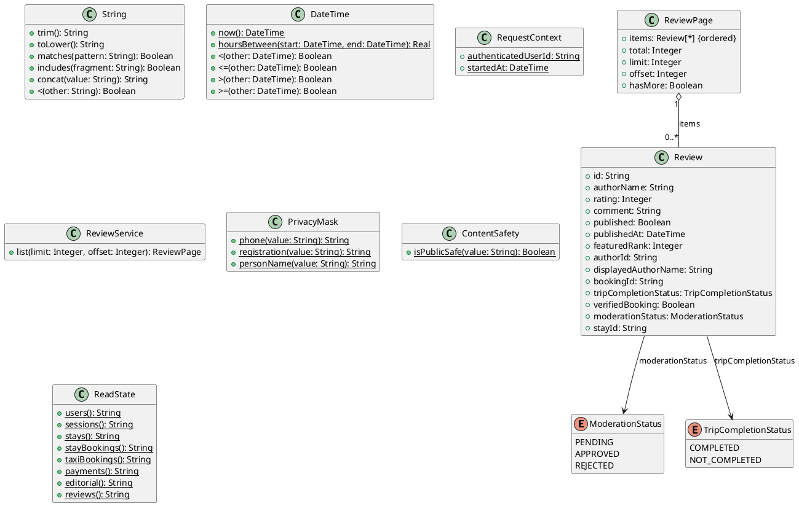

# UC-18 — View Traveller Reviews

### Description

As a visitor or authenticated user, I want to read published traveller reviews.

### Actors

Visitor; Authenticated User; Review Service.

### Priority

P2.

### Trigger

**TRG-UC-18-01** — The actor opens a page or section that presents traveller reviews.

### Preconditions

- **PRE-UC-18-01** — The actor can access a page or section that presents traveller reviews.

### Postconditions

- **POST-UC-18-01** — The client displays the review-page state returned by the system.
- **POST-UC-18-02** — Available pagination or navigation remains accessible.

### Basic Flow

1. The actor opens a review section or a page containing featured reviews.
2. The client requests the relevant review page.
3. The system processes the request and returns a page outcome.
4. The client renders the review presentations represented by the response.
5. The actor reviews the displayed content.
6. The actor may request another review page when that interaction is available.

### Alternative Flows

#### AF-UC-18-01

1. If no reviews are returned, the client displays or omits the section according to the related design.

#### AF-UC-18-02

1. A featured-review section requests the page size represented by its design.

### Exception Flows

#### EF-UC-18-01

1. If another review page cannot be loaded, the client keeps the displayed reviews and offers a retry.

#### EF-UC-18-02

1. If the initial request fails, the client displays the designed unavailable state.

### UML Model



### Business Rules

```ocl
-- BR-UC-18-01
-- Source: Assumption
context ReviewService::list(limit: Integer, offset: Integer): ReviewPage
post BR_UC_18_01_OnlyModeratedPublicReviewsAreReturned:
  result.items->forAll(r |
    r.moderationStatus = ModerationStatus::APPROVED and
    r.published and r.publishedAt <= RequestContext::startedAt)
```

```ocl
-- BR-UC-18-02
-- Source: Assumption
context ReviewService::list(limit: Integer, offset: Integer): ReviewPage
post BR_UC_18_02_VerifiedBadgeReflectsCompletedTravel:
  result.items->forAll(r |
    r.verifiedBooking =
      (r.bookingId <> null and
       r.tripCompletionStatus = TripCompletionStatus::COMPLETED))
```

```ocl
-- BR-UC-18-03
-- Source: Assumption
context ReviewService::list(limit: Integer, offset: Integer): ReviewPage
post BR_UC_18_03_PublicAuthorIdentityIsPrivacyPreserving:
  result.items->forAll(r |
    r.displayedAuthorName = PrivacyMask::personName(r.authorName))
```

```ocl
-- BR-UC-18-04
-- Source: Assumption
context ReviewService::list(limit: Integer, offset: Integer): ReviewPage
post BR_UC_18_04_PublicCommentPassesContentSafetyProjection:
  result.items->forAll(r | ContentSafety::isPublicSafe(r.comment))
```

```ocl
-- BR-UC-18-05
-- Source: Assumption
context ReviewService::list(limit: Integer, offset: Integer): ReviewPage
post BR_UC_18_05_ReviewOrderIsRecentAndDeterministic:
  result.items->size() <= 1 or
  Sequence{1..result.items->size() - 1}->forAll(i |
    result.items->at(i).publishedAt > result.items->at(i + 1).publishedAt or
    (result.items->at(i).publishedAt = result.items->at(i + 1).publishedAt and
      result.items->at(i).id < result.items->at(i + 1).id))
```

```ocl
-- BR-UC-18-06
-- Source: Assumption
context ReviewService::list(limit: Integer, offset: Integer): ReviewPage
post BR_UC_18_06_PageMetadataMatchesItsSlice:
  result.limit = limit and result.offset = offset and result.total >= 0 and
  result.items->size() = (result.total - offset).max(0).min(limit) and
  result.hasMore = (offset + result.items->size() < result.total)
```

```ocl
-- BR-UC-18-07
-- Source: Assumption
context ReviewService::list(limit: Integer, offset: Integer): ReviewPage
post BR_UC_18_07_ReviewRetrievalIsReadOnly:
  ReadState::reviews() = ReadState::reviews()@pre
```

```ocl
-- BR-UC-18-08
-- Source: Assumption
context ReviewService::list(limit: Integer, offset: Integer): ReviewPage
pre BR_UC_18_08_PageRequestHasUsableBounds:
  limit > 0 and offset >= 0
```

```ocl
-- BR-UC-18-09
-- Source: Assumption
context ReviewService::list(limit: Integer, offset: Integer): ReviewPage
post BR_UC_18_09_RatingsAndReviewIdentityAreWellFormed:
  result.items->isUnique(r | r.id) and
  result.items->forAll(r | r.rating >= 1 and r.rating <= 5)
```

### Related UI

`reviews`; home-page testimonial sections.

### Related APIs

`API-REVIEW-LIST`.
